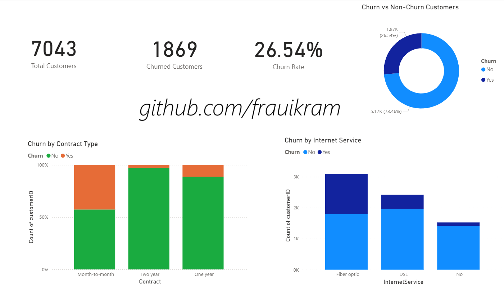
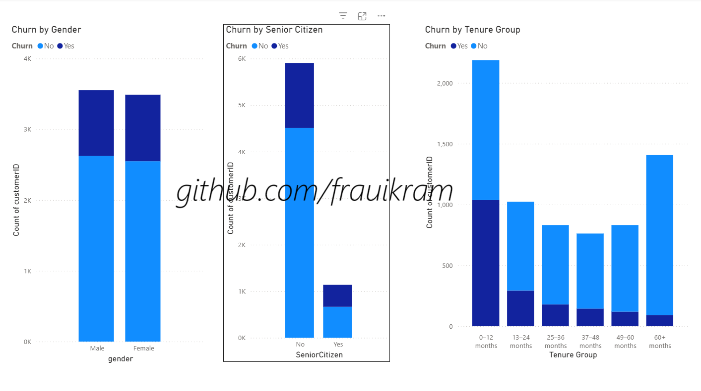
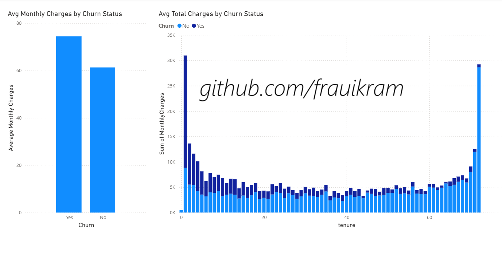

# customer-churn-analysis-powerbi

# 📊 Customer Churn Power BI Dashboard

This project presents an end-to-end churn analysis using **Power BI** based on the **IBM Telco Customer Churn** dataset. The goal is to identify churn patterns, demographic impact, and revenue insights to support data-driven retention strategies.

---

## 🗂️ Project Structure

customer-churn-powerbi/
├── data/
│ └── WA_Fn-UseC_-Telco-Customer-Churn.csv
├── visuals/
│ ├── overview-page.png
│ ├── demographics-page.png
│ └── revenue-page.png
├── customer-churn-dashboard.pbix
└── README.md

---

## 📈 Dashboard Pages

### 🔹 1. Overview
- KPIs: Total Customers, Churned Customers, Churn Rate
- Churn by Contract Type
- Churn by Internet Service
- Churn Distribution (Donut Chart)

### 🔹 2. Demographics
- Churn by Gender
- Churn by Senior Citizen
- Churn by Tenure Group (0–12, 13–24, etc.)

### 🔹 3. Revenue & Behavior
- Average Monthly Charges by Churn
- Average Total Charges by Churn
- Tenure vs Monthly Charges (Scatter Plot)

---

## 🧠 Key Insights

- Customers on **month-to-month contracts** churn the most
- **Fiber optic internet** users have a higher churn rate than DSL
- Customers with **low tenure** and **high monthly charges** are at high risk
- **Senior citizens** have slightly higher churn, but it's not the only factor

---

## 📊 Dataset Info

- 📌 Source: [Kaggle – Telco Customer Churn](https://www.kaggle.com/datasets/blastchar/telco-customer-churn)
- 📦 Records: 7,043 customers
- 🎯 Features: Contract type, tenure, monthly charges, total charges, demographic data, churn status

---

## 🛠️ Tools Used

- **Power BI Desktop**
- **DAX** (Custom measures for KPIs)
- **Power Query Editor** (Data cleaning and transformation)

---

## 📸 Dashboard Previews

| Overview | Demographics | Revenue & Behavior |
|----------|--------------|--------------------|
|  |  |  |

---

## 📬 Author

Built by frauikram — to showcase dashboarding, DAX, and storytelling skills for analytics portfolios.  
Feel free to ⭐ the repo or connect with me on [LinkedIn](linkedIn.com/in/rehmaikram)!

